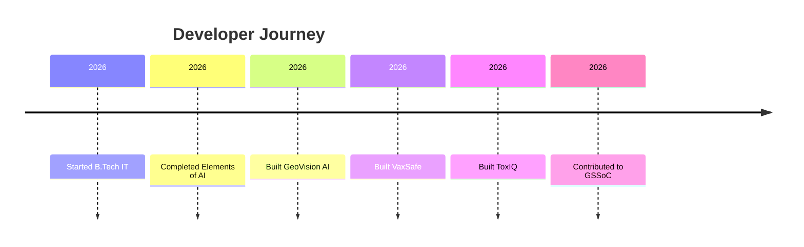

## Hi there 👋

<!--
**yashvendranirwan-alt/yashvendranirwan-alt** is a ✨ _special_ ✨ repository because its `README.md` (this file) appears on your GitHub profile.

Here are some ideas to get you started:

- 🔭 I’m currently working on ...
- 🌱 I’m currently learning ...
- 👯 I’m looking to collaborate on ...
- 🤔 I’m looking for help with ...
- 💬 Ask me about ...
- 📫 How to reach me: ...
- 😄 Pronouns: ...
- ⚡ Fun fact: ...
-->
<div align="center">


# 🚀 Building AI, Computer Vision & Healthcare Tech


</div>

---

## ⚡ About Me

```yaml
Name: Yashvendra Singh
Role: B.Tech IT Student
Location: India
Focus:
  - Artificial Intelligence
  - Computer Vision
  - Web Development
  - Healthcare Technology
  - Open Source

Current Mission:
  Building impactful technology that solves real-world problems.
```

---

## 🛠 Tech Stack

<div align="center">


</div>

### Additional Skills

- OpenCV
- NumPy
- Streamlit
- Prompt Engineering
- Generative AI
- Canva
- MS Excel
- MS Word

---

## 📊 Developer Dashboard

<div align="center">


</div>

<div align="center">


</div>

---

## 🏆 Featured Projects

### 🌍 GeoVision AI

AI-powered geospatial image analysis platform.

#### Features
- Satellite image analysis
- Computer Vision pipeline
- Feature extraction
- Image preprocessing
- Interactive visualization

#### Stack

```text
Python
OpenCV
NumPy
Streamlit
```

---

### 💉 VaxSafe

Cold-chain monitoring system for vaccine safety.

#### Features
- Vaccine storage monitoring
- Healthcare logistics support
- Data tracking
- Safety monitoring
- Web dashboard

🏅 Secured 4th Position in Projectathon 2026

---

### 🧬 ToxIQ

AI-powered drug toxicity prediction platform.

#### Features
- SMILES processing
- Morgan Fingerprints
- Toxicity prediction
- XGBoost models
- Drug discovery support

---

### 🛒 Vibe Gadgets

Shopify-based e-commerce platform.

#### Features
- Product management
- Payment integration
- Mobile responsive UI
- Customer flow optimization

---

## 📜 Certifications

🏆 Elements of AI

🏆 Claude Code In Action

---

## 🌱 Currently Learning

```text
Advanced AI Systems
Machine Learning
Computer Vision
Open Source Development
Software Engineering
```

---

## 🔥 GitHub Activity Graph

<div align="center">


</div>

---

## 🏅 Trophy Cabinet

<div align="center">


</div>

---

## ⚔️ Open Source Journey



---

## 🐍 Contribution Snake

> Create `.github/workflows/snake.yml`

```yaml
name: Generate Snake

on:
  schedule:
    - cron: "0 */12 * * *"

  workflow_dispatch:

jobs:
  build:
    runs-on: ubuntu-latest

    steps:
      - uses: Platane/snk@v3
        with:
          github_user_name: YOUR_USERNAME
          outputs: dist/github-contribution-grid-snake.svg
```

---

## 🎯 2026 Goals

- Contribute more to Open Source
- Build Production AI Products
- Secure High Quality Internship
- Learn Advanced Computer Vision
- Develop Healthcare Technology Solutions

---

## 🌐 Connect With Me

<div align="center">

<a href="https://github.com/YOUR_USERNAME">

</a>

<a href="mailto:yashvendranirwan@gmail.com">

</a>

<a href="YOUR_PORTFOLIO_LINK">

</a>

</div>

---

<div align="center">

### 🚀 Building technology that creates real-world impact.

</div>


